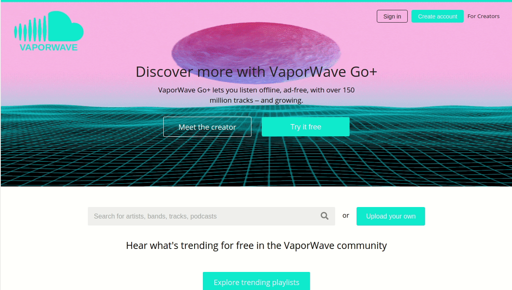
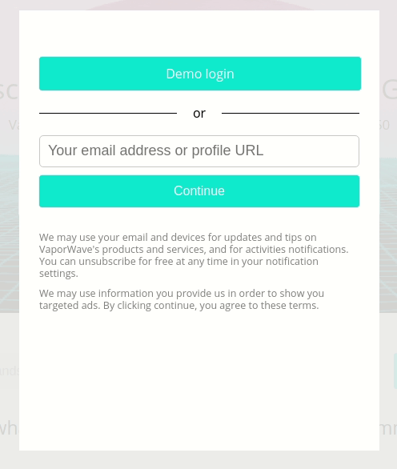
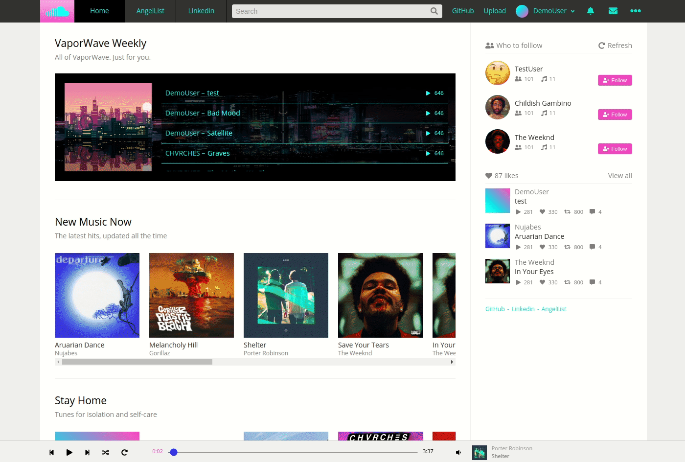
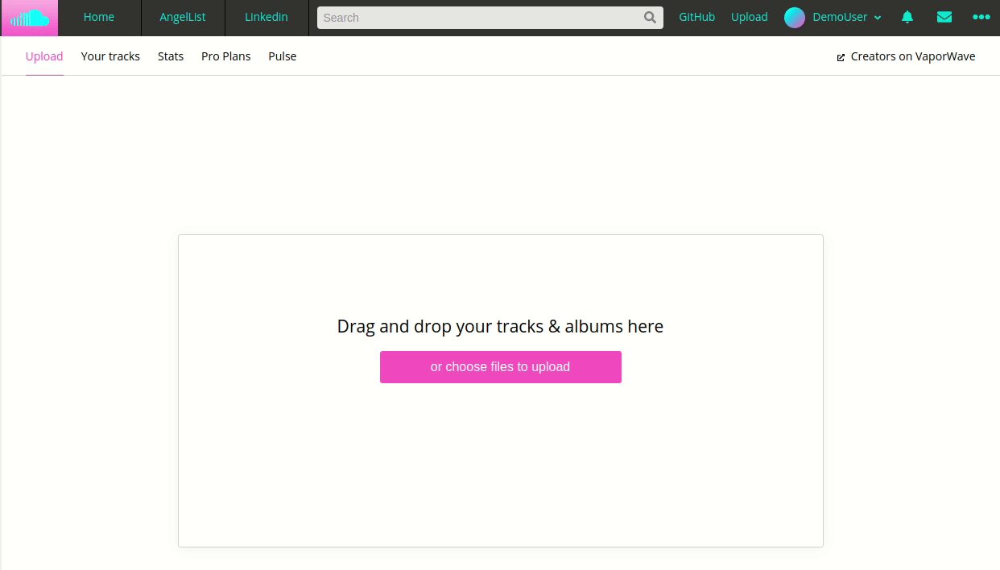
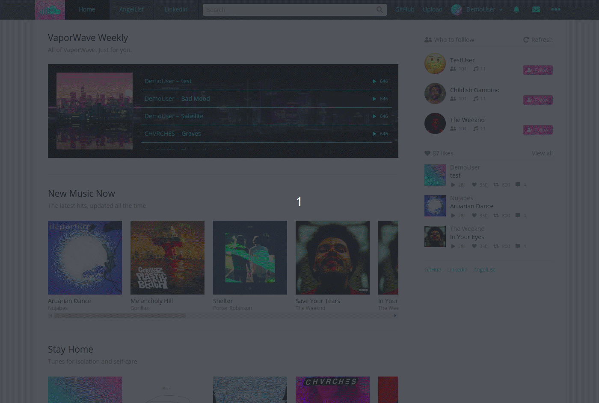
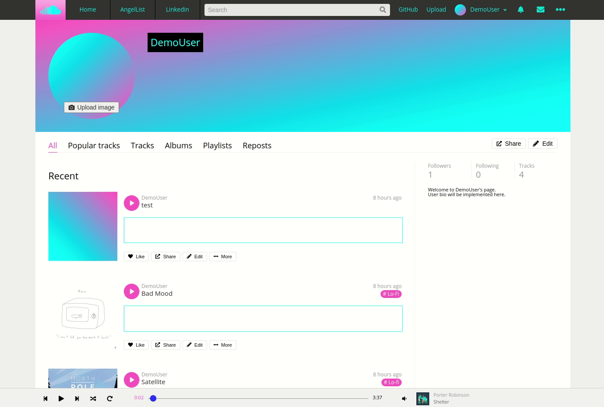

# VaporWave

[VaporWave](http://vaporwave-app.herokuapp.com/) is a [SoundCloud](https://soundcloud.com/) clone. It is an online music sharing platform where anyone, from up-and-coming artists to professionals, can upload their music for users to discover. Users will be able to listen to any music that is uploaded. The VaporWave name is a play on words of the SoundCloud name and the website's aesthetic.

## Technologies Used

### Frontend
React.js\
Redux.js\
Javascript\
CSS/SCSS

### Backend
Ruby on Rails\
PostgreSQL

### Hosting
AWS S3\
Heroku

## Features

### User Authentication
#### Users will be able to sign up, log in, and log out

* VaporWave gives access to a demo account to try out all of the features
* Errors will be shown when the criteria for authentication is not met

### Upload
#### Users will be able to upload songs along with an optional photo

* Files can be drag and dropped for upload

### Music Player
#### Users can listen to music via our custom music player

* Users can navigate the website while listening to music without interruption
* Seek bar, Skip, Rewind, and Volume Bar have full functionality

### Profile Page
#### Users will have a profile page

* The profile page will display all of the user's uploaded songs

## Updates in Progress

Comments on songs\
Waveforms\
Likes/Follows\
Playlists